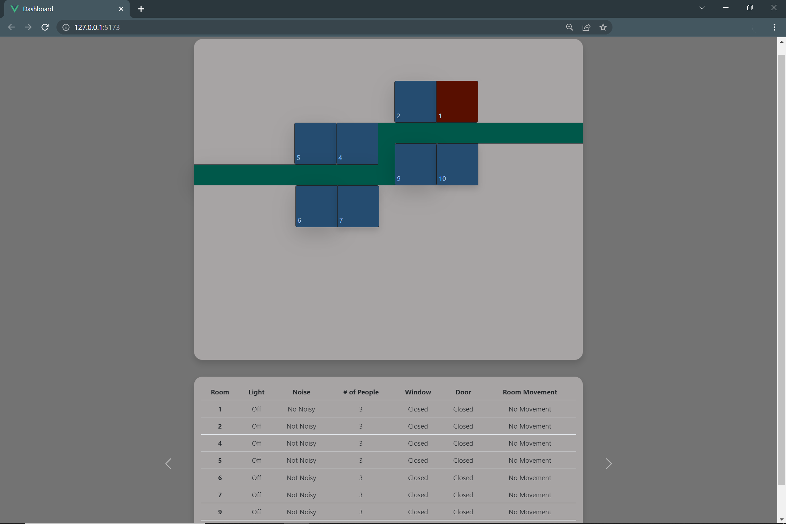
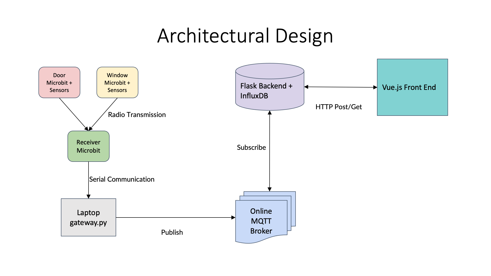

<div id="top"></div>
<!--
*** Template from: https://github.com/othneildrew/Best-README-Template
*** Thanks for checking out the Best-README-Template. If you have a suggestion
*** that would make this better, please fork the repo and create a pull request
*** or simply open an issue with the tag "enhancement".
*** Don't forget to give the project a star!
*** Thanks again! Now go create something AMAZING! :D
-->

<!-- PROJECT LOGO -->
<br />
<div align="center">
  <a href="https://github.com/MarkMa512/smart-hostel">
    
  </a>

<h3 align="center">Smart Hostel Management System</h3>

  <p align="center">
    a CS462 Internet Of Things: Technology and Application Project
    <br />
    <a href="https://github.com/MarkMa512/smart-hostel"><strong>Explore the docs »</strong></a>
    <br />
    <br />
    <a href="https://youtu.be/VCjBWMjaBcI">View Video Demo</a>
    ·
    <a href="https://github.com/MarkMa512/smart-hostel/issues">Report Bug</a>
    ·
    <a href="https://github.com/MarkMa512/smart-hostel/issues">Request Feature</a>
  </p>
</div>

<!-- TABLE OF CONTENTS -->
<details>
  <summary>Table of Contents</summary>
  <ol>
    <li>
      <a href="#about-the-project">About The Project</a>
      <ul>
        <li><a href="#dashboard-screenshot">Dashboard Screenshoot</a></li>
        <li><a href="#video-demo">Video Demo</a></li>
        <li><a href="#built-with">Built With</a></li>
        <li><a href="#directories">Directories</a></li>
        <li><a href="#architectural-diagram">Architectural Diagram</a></li>
      </ul>
    </li>
    <li>
      <a href="#getting-started">Getting Started</a>
      <ul>
        <li><a href="#prerequisites">Prerequisites</a></li>
        <li><a href="#sensors-and-device-configuration">Sensors and device configuration</a></li>
        <li><a href="#installation">Installation</a></li>
      </ul>
    </li>
    <li><a href="#roadmap">Roadmap</a></li>
    <li><a href="#acknowledgments">Acknowledgments</a></li>
  </ol>
</details>


<!-- ABOUT THE PROJECT -->
## About The Project

### Dashboard Screenshoot


### Video Demo
[](https://www.youtube.com/watch?v=VCjBWMjaBcI)


### Built With
* [Micro:bits](https://microbit.org/)
* [Flask](https://flask.palletsprojects.com/en/2.2.x/)
* [InfluxDB](https://www.influxdata.com/)
* [Vue.js](https://vuejs.org)

<p align="right">(<a href="#top">back to top</a>)</p>

### Directories
- [`/back_end`](https://github.com/MarkMa512/smart-hostel/tree/master/back_end): Flask backend application that interact with InfluxDB and provides REST API for the Front-end dashboard to interact  with.  

- [`/data_collection`](https://github.com/MarkMa512/smart-hostel/tree/master/data_collection): Data collection for sense making and visualization.  

    - [`/data_collection/data`](https://github.com/MarkMa512/smart-hostel/tree/master/data_collection/data)  
    The light and sound data collected on 11/10/22 and 13/10/22 from a room.  
    Format: date, time, sounds, light  
    
  - [`/data_collection/data_reciever`](https://github.com/MarkMa512/smart-hostel/tree/master/data_collection/data_receiver)  
    A node.js application that reads the serial data from reciever microbit. 

  - [`/data_collection/desktop_client`](https://github.com/MarkMa512/smart-hostel/tree/master/data_collection/desktop_client)  
    Desktop client written in Python that logs the data to CSV file into the [`/data_collection/data`](https://github.com/MarkMa512/smart-hostel/tree/master/data_collection/data) directory.  

  - [`/data_collection/dummy_data`](https://github.com/MarkMa512/smart-hostel/tree/master/data_collection/dummy_data) 
    Simulated data for demonstration purposes

- [`/front_end`](https://github.com/MarkMa512/smart-hostel/tree/master/front_end): Vue.js front-end dashboard 

- [`/media`](https://github.com/MarkMa512/smart-hostel/tree/master/media): photos of models, setup and illustrations

- [`/sensor_and_gateway`](https://github.com/MarkMa512/smart-hostel/tree/master/sensor_and_gateway): Microbit programs and gateway porgam

### Architectural Diagram




<!-- GETTING STARTED -->
## Getting Started

### Prerequisites
1. Ensure [Python 3.9](https://www.python.org/downloads/) or higher is installed 
2. Ensure [Node.js 16](https://nodejs.org/en/) or higher is installed

### Sensors and device configuration
1. sensor_microbit_door_microbit
- Micro-controller: [Micro:bit V2](https://microbit.org/new-microbit/)
- Micro-controller Program: [`/sensor_and_gateway/sensor_door_microbit.py`](https://github.com/MarkMa512/smart-hostel/blob/master/sensor_and_gateway/sensor_door_microbit.py) 
- Extension board: [Octopus:bit(EF03405)](https://www.elecfreaks.com/learn-en/microbitExtensionModule/octopus_bit.html) 
- Sensors: 
  - HC-SR-04 Ultrasonic Distance Sensor
    - sonar_out: 
      - Vcc: Pin12 3V
      - Trig: Pin12 S
      - Echo: Pin13 S
      - Gnd: Pin13 G
    - sonar_in: 
      - Vcc: Pin15 3V
      - Trig: Pin15 S
      - Echo: Pin16 S
      - Gnd: Pin16 G
  - [DFROBOT Magnetic Sensor V2](https://wiki.dfrobot.com/Digital_magnetic_sensor_SKU__DFR0033)
    - Please align the color of the cable to that of the Octopus:bit board, at Pin0. 


2. sensor_microbit_window_microbit
- Micro-controller: [Micro:bit V1](https://microbit.org/new-microbit/)
- Micro-controller Program: [`/sensor_and_gateway/sensor_window_microbit.py`](https://github.com/MarkMa512/smart-hostel/blob/master/sensor_and_gateway/sensor_window_microbit.py)  
- Extension board: [YWRobot micro:bit IO Extension Board](http://wiki.ywrobot.net/index.php?title=(SKU:BRD080003)IO_Extension_Board扩展板适用于Micro:bit)
- Sensors
  - [HC SR501 PIR Motion Sensor](https://lastminuteengineers.com/pir-sensor-arduino-tutorial/)
    - GND: G
    - OUT: Pin0
    - VCC: 3V


3. reciever_microbit
- Micro-controller: [Micro:bit V1](https://microbit.org/new-microbit/)
- Micro-controller Program: [`/sensor_and_gateway/reciever_microbit.py`](https://github.com/MarkMa512/smart-hostel/blob/master/sensor_and_gateway/reciever_microbit.py) 
- Connect to the Gateway machine via USB cable. 

### Installation

1. Clone the repo onto the respective machines
   ```sh
   git clone https://github.com/MarkMa512/smart-hostel.git
   ```
2. Setup the Microbits according to <a href="#sensors-and-device-configuration">Sensors and device configuration</a>

3. Gateway Machine:  
  a. Enter
    ```sh
    cd sensor_and_gateway
    ```

  b. Install the dependencies
    ```sh
    pip install -r requirement.txt
    ```
  
  c. run `gateway.py`: 
    ```sh
    python3 gateway.py
    ```
   or 
    ```sh
    python gateway.py
    ```

4. Back-end Machine: Please refer to [`back_end/README.md`](https://github.com/MarkMa512/smart-hostel/tree/master/back_end#readme)

5. Front-end Machine: Please refer to [`front_end/README.md`](https://github.com/MarkMa512/smart-hostel/tree/master/front_end#readme)

<p align="right">(<a href="#top">back to top</a>)</p>


<!-- ROADMAP -->
## Roadmap
- [x] Feature 1: 
  - [x] Feature a: 
  - [x] Feature b: 
  - [x] Feature c:
- [x] Feature 2: 
  - [x] Feature a: 
  - [x] Feature b: 
  - [x] Feature c: 
- [x] Feature 3: 
  - [x] Feature a: 
  - [x] Feature b: 
  - [x] Feature c: 


<p align="right">(<a href="#top">back to top</a>)</p>


<!-- ACKNOWLEDGMENTS -->
## Acknowledgments

Team Member:
- Integration: [Jin Ningxian](https://github.com/jinningxian)
- Sesnor and Model: [Ma Ningzhi](https://github.com/MarkMa512)
- Front-end: [Ng Jing Wen](https://github.com/ngjw1599)
- Back-end: [Tan Jun An](https://github.com/junan-tan-2019)
- Algorithm and Analysis: [Tan Keah Keat](https://github.com/kk-tan-2019)

<p align="right">(<a href="#top">back to top</a>)</p>
